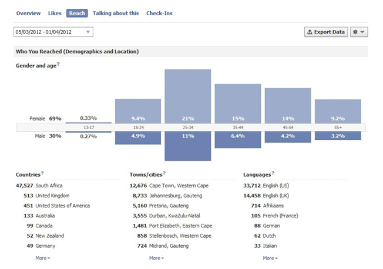
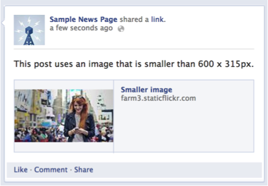
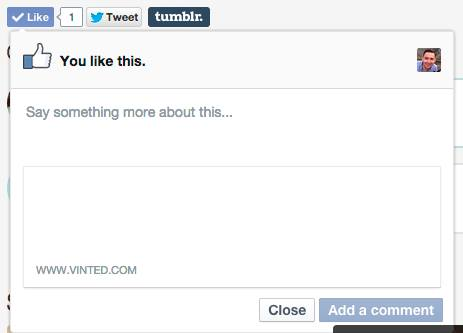

# Facebook

Facebook want all websites-- and in particular news sites, magazines, blogs, and other media sites-- to easily reach their existing fans and grow their fan base. Follow these best practices to give people the most engaging Facebook experience.

### 1. Use Facebook Insights to measure the success of your content.

Some plugins also have a `ref` parameter which can be used to track traffic generation on your site. If a friend clicks on a story about someone liking one of your pages, Facebook will pass the `ref` parameter back to your site, where you can track it with your own analytics software. See the parameters for [social plugins](https://developers.facebook.com/docs/plugins) for more info.

### 2. Use proper Open Graph tags

When someone shares content from your site to Facebook, our crawler will scrape the HTML of the URL that is shared. On a regular HTML page this content is basic and may be incorrect, because the scraper has to guess which content is important, and which is not.

Take control of what the Facebook crawler picks up from each page by using [Open Graph meta tags](https://developers.facebook.com/docs/sharing/webmasters#markup). These tags provide structured info about the page such as the title, description, preview image, and more.

**Good Examples**

**Title**

A clear title without branding or mentioning the domain itself.

**URL**

A URL with no session id or extraneous parameters. All shares on Facebook will use this as the identifying URL for this article.

**Description**

A clear description, at least two sentences long.

**Facebook App ID**

A Facebook App ID that identifies your website to Facebook.

**Object Type**

The type of object:

**Localization**

This article has some translations:

**Author and Publisher**

This article has an author and a publisher:

## **Bad Examples**

**Bad Title**

The title should not have branding or extraneous information.

**Bad URL**

This URL has extraneous information that changes from user to user, resulting in likes/shares spread across multiple URLs, instead of being aggregated for all users sharing this article.

**Generic Description**

This is a generic description that will not entice users to click.

**Generic Image**

This is a generic image that will look the same for all stories. It is only 100px by 100px, which will not be usable on higher resolution displays.

**Missing Facebook App ID**

Don’t forget the `fb:app_id`, `article:author` and `article:publisher` tags!  

##  Optimize images to generate great previews

**Image Sizes**

Use images that are at least 1200 x 630 pixels for the best display on high resolution devices. At the minimum, you should use images that are 600 x 315 pixels to display link page posts with larger images. Images can be up to 8MB in size.

**Small Images**

If your image is smaller than 600 x 315 px, it will still display in the link page post, but the size will be much smaller.  

Facebook also redesigned link page posts so that the aspect ratio for images is the same across desktop and mobile News Feed. Try to keep your images as close to 1.91:1 aspect ratio as possible to display the full image in News Feed without any cropping.

**Minimum Image Size**

The minimum image size is 200 x 200 pixels. If you try to use an image smaller than this you will see an error in the [Sharing Debugger](https://developers.facebook.com/tools/debug).

### There are two ways to avoid this and have images render on the first Like or Share action:

#### Pre-caching images {#precaching}

When content is shared for the first time, the Facebook crawler will scrape and cache the metadata from the URL shared. The crawler has to see an image at least once before it can be rendered. This means that the first person who shares a piece of content won't see a rendered image:  

**1. Pre-cache the image with the Sharing Debugger**

Run the URL through the URL debugger to pre-fetch metadata for the page. You should also do this if you update the image for a piece of content.

**2. Use og:image:width and og:image:height Open Graph tags**

Using these tags will specify the image dimensions to the crawler so that it can render the image immediately without having to asynchronously download and process it.  

